# Xinmiji Psychological Assessment System

  A Web App using Maven, Tomcat, MySQL, MyBatis, SpringMVC, Layui and jQuery, edited in IDEA.

------

# 项目设计文档

------

## 项目概述

### 小组成员

- A，负责项目总体框架设计
- B，负责前端设计，文档撰写
- C，负责数据库设计以及相关交互，PPT制作

### 技术选型

- 项目管理工具：Maven
- Web服务器：Tomcat
- 数据库管理系统：MySQL
- SQL持久层映射框架：MyBatis
- Web框架：SpringMVC
- 前端框架：Layui
- 前端交互：jQuery

------

## 需求分析

心秘籍心理测评系统的定位是一款用户友好的Web应用。具体而言，应用的需求可以拆解为如下部分进行具体化分析。

### 功能需求

功能需求是系统用户对系统功能的需求。在本系统中，系统的用户群体主要有两类：普通用户、系统管理员。对于每一类用户群体而言，其需求又可以细分为显式需求、隐式需求和实际需求。由于实际需求需要在系统完善之后接受用户测试时才能体现，故不在开发前的需求分析的讨论范围之内。这里，仅对用户以及系统管理员的显式需求和隐式需求进行分析。

#### 显式需求

普通用户使用系统主要进行的活动为：心理测评问卷填写、测评报告查阅、专栏文章阅读。考察目前常见的问卷系统以及用户需求后可以得出：

- 测评系统需要具备基本的问卷模块，包括问卷查看、问卷填写、问卷报告生成。
- 测评系统需要一个专栏模块，用于提供专栏内文章的阅读接口。

管理员使用系统进行系统管理工作，对系统的管理功能以及管理员的需求进行考察后可以得出：

- 系统需要一批具有特殊身份的用户，即管理员，对系统进行维护，包括但不限于问卷生成，查看用户问卷填写结果，管理专栏，管理用户权限。

#### 隐式需求

系统的隐式需求主要体现在用户对系统的其他需求上。对于测评系统，系统的使用者都隐式要求系统具有简单但功能丰富的操作界面，要求系统反馈及时。例如对于问卷填写，填写界面应简洁直观，所见即所得。

### 非功能需求

系统的非功能需求又称为质量需求，是与用户需求无关的，对软件质量进行约束的需求。对于一个测评系统而言，我们需要关注的是系统的性能、可维护性、安全性。因此，其非功能需求分析应围绕性能需求、可维护性需求、安全性需求三个方面展开。

#### 可维护性需求

测评系统的可维护性主要体现在系统的稳定性以及系统管理员的工作量上。系统的稳定性，即系统对于外部环境发生变化时所需要的做的修改工作量。对于测评系统而言，系统涉及最多的维护工作是问卷的生成和发布。对于问卷生成而言，主要的操作者是系统管理员，系统应当为管理员提供尽可能方便的系统接口，使得管理员对于问卷的平均管理成本尽可能降低，尽可能实现问卷管理的自动化，减少管理维护成本，提高系统可维护性。

#### 安全性需求

系统的安全性主要体现在对用户权限的管理上。普通用户的权限应得到严格限制，管理员权限的发放也只能由管理员进行。同时，不同用户之间的数据应保持独立，只有管理员才可以查看其他用户的问卷信息。

### 数据流图

基于以上分析，可以得到系统2个主要业务的数据流图。

#### 测评系统数据流图

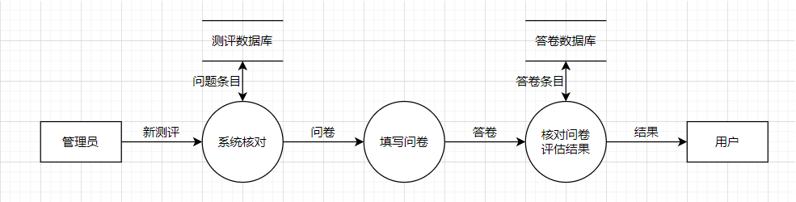

#### 专栏系统数据流图

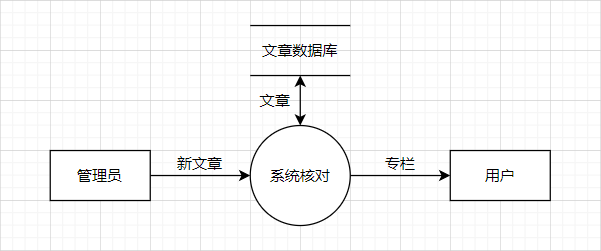

------

## 总体设计

### 用例图

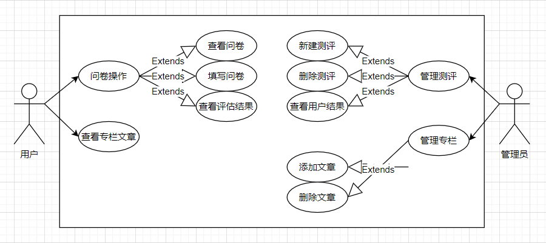

### 系统结构图

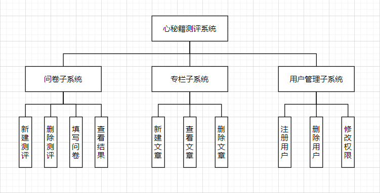

### 数据库设计

见[数据库设计文档](数据库设计.md)。

------

## 详细设计

### 界面设计

用户界面使用**Layui**和**jQuery**，构建响应式的前端。

Layui是一款模块化的前端框架，因其简单而又充实的内在而受到欢迎。Layui是一款采用自身模块规范编写的前端 UI 框架，它遵循原生的 HTML/CSS/JS 书写方式。它虽然外在极简，但是内容丰富，里面包含众多组件从核心代码到 API 都非常适合界面的快速开发。

jQuery是一个快速、简洁的JavaScript框架，是继Prototype之后又一个优秀的JavaScript代码库（或JavaScript框架）。jQuery设计的宗旨是“write Less，Do More”，即倡导写更少的代码，做更多的事情。它封装JavaScript常用的功能代码，提供一种简便的JavaScript设计模式，优化HTML文档操作、事件处理、动画设计和Ajax交互。

jQuery的核心特性可以总结为：具有独特的链式语法和短小清晰的多功能接口；具有高效灵活的css选择器，并且可对CSS选择器进行扩展；拥有便捷的插件扩展机制和丰富的插件。可以极大简化JS代码，可以像CSS那样来获取页面 元素，可以操作CSS属性来控制页面的效果 ，可以兼容常用的浏览器。

下图是本系统的一个前端代码片段。

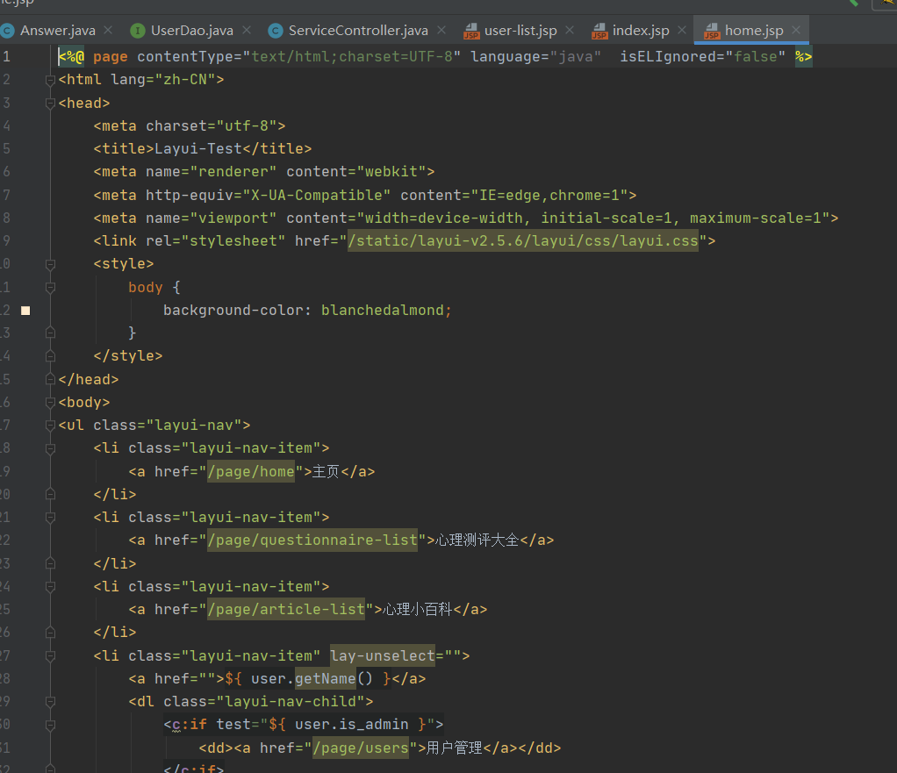

对应的界面如下。

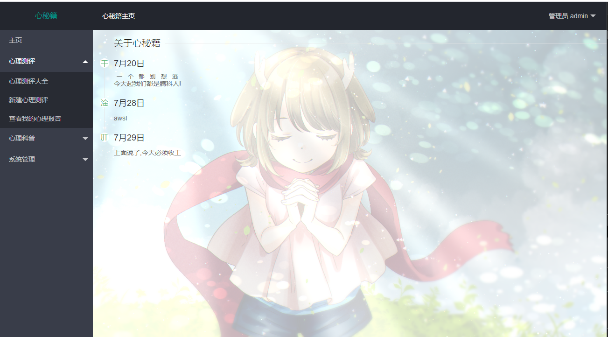

### 框架搭建

项目架构选择基于**Maven**构建轻量Web应用，选用**IDEA**作为IDE。使用Maven可以进行项目高度自动化构建，依赖管理，仓库管理。而是java语言开发的集成环境，IntelliJ在业界被公认为最好的java开发工具之一，尤其在智能代码助手、代码自动提示、重构、J2EE支持、各类版本工具(git、svn、github等)、JUnit、CVS整合、代码分析、 创新的GUI设计等方面的功能可以说是超常的。

构建项目后，首先在`pom.xml`中引入依赖。

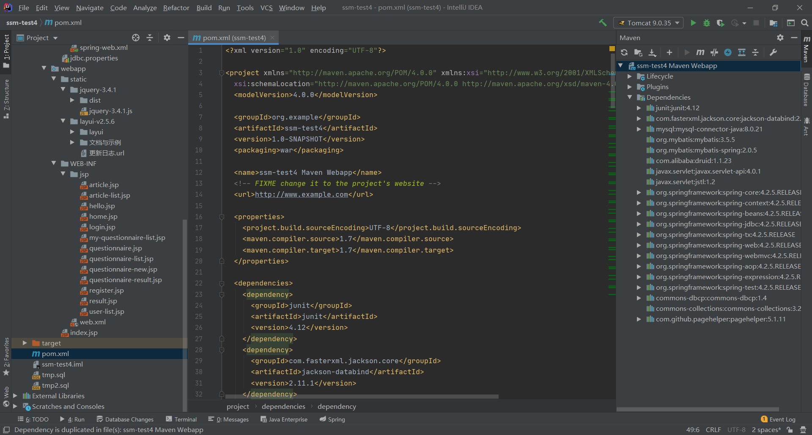

选择**MySQL**作为数据库管理系统，同时在MySQL打开连接，并接入项目。MySQL是一个关系型数据库管理系统，由瑞典 MySQL AB 公司开发，目前属于 Oracle 公司。MySQL 使用的 SQL 语言是用于访问数据库的最常用的标准化语言。由于 MySQL 数据库体积小、速度快、总体拥有成本低、开放源代码，其有着广泛的应用，一般中小型网站的开发都选择 MySQL 作为网站数据库。

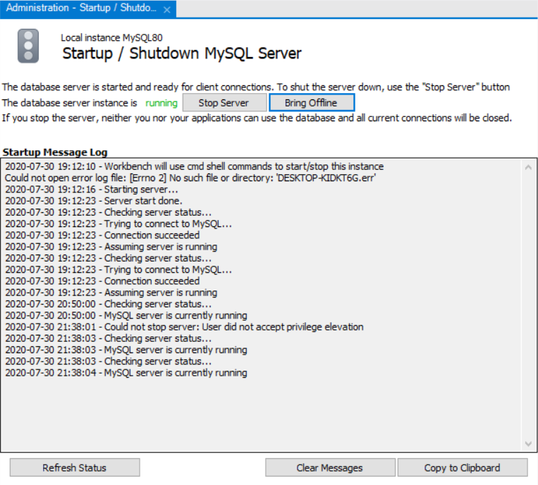

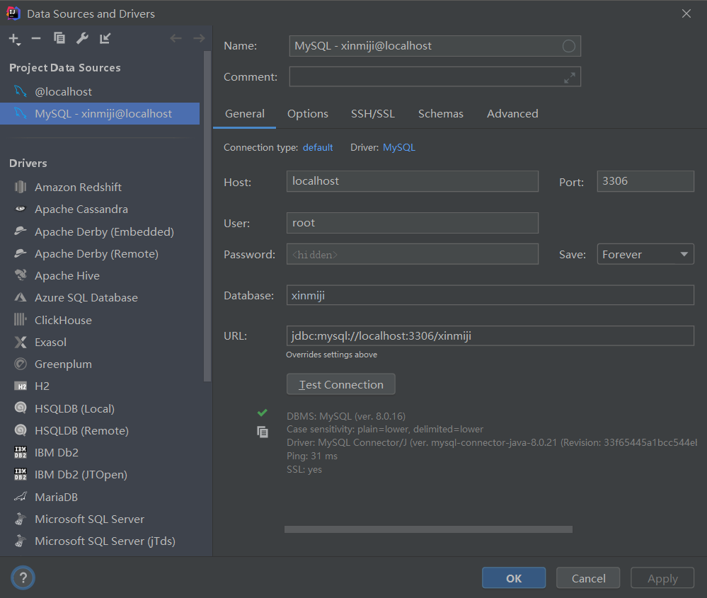

选择**MyBatis**作为SQL映射框架。MyBatis 世界上流行最广泛的SQL 映射框架，由Clinton Begin 在2002 年创建，iBATIS一词来源于“internet”和“abatis”的组合，是一个基于Java的持久层框架。

在`pom.xml`中配置相关依赖。

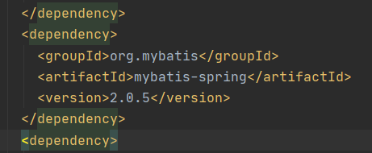

选择**SpringMVC**作为应用框架，引入日志包和相关jar包。Spring的核心是轻量级的容器，它实现了IoC容器、非侵入性的框架，并提供AOP概念的实现方式，提供对持久层、事务的支持，提供MVC Web框架的实现，并对一些常用的企业服务API提供一致的模型封装，是一个全方位的应用程序框架。

选择**Tomcat**作为Web服务器。Tomcat是应用（java）服务器，它是一个servlet容器，是Apache的扩展。

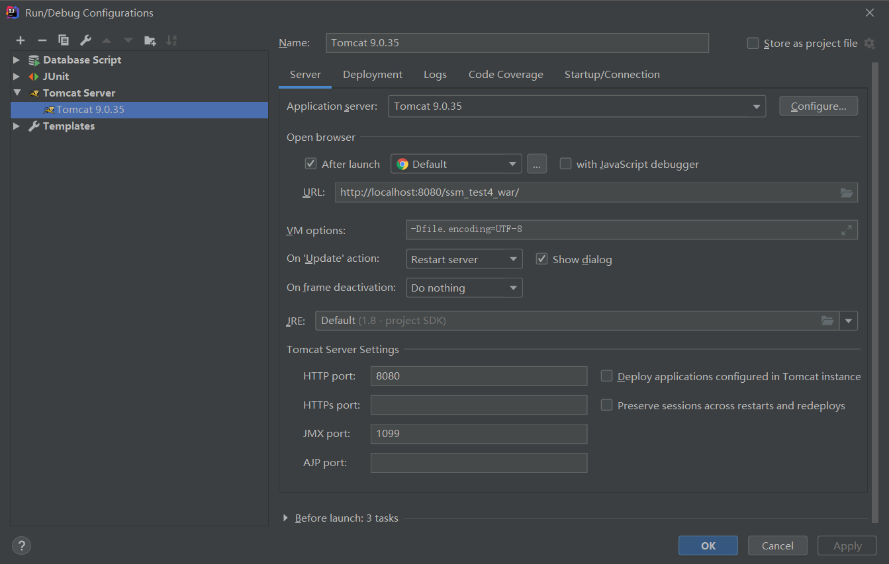

------

## 系统实现

应用基于经典的**MVC模式**进行开发。MVC全名是Model View Controller，是模型(model)－视图(view)－控制器(controller)的缩写，一种软件设计典范，用一种业务逻辑、数据、界面显示分离的方法组织代码，将业务逻辑聚集到一个部件里面，在改进和个性化定制界面及用户交互的同时，不需要重新编写业务逻辑。MVC被独特的发展起来用于映射传统的输入、处理和输出功能在一个逻辑的图形化用户界面的结构中。

因此，对于系统中功能的实现方式是类似的，故只对系统核心业务——问卷操作的开发进行说明。

对于问卷填写功能，首先需要一个**模型**，用于存取数据库中的测评问卷，对应为一个实体类，类属性与数据库中的内容相关联。

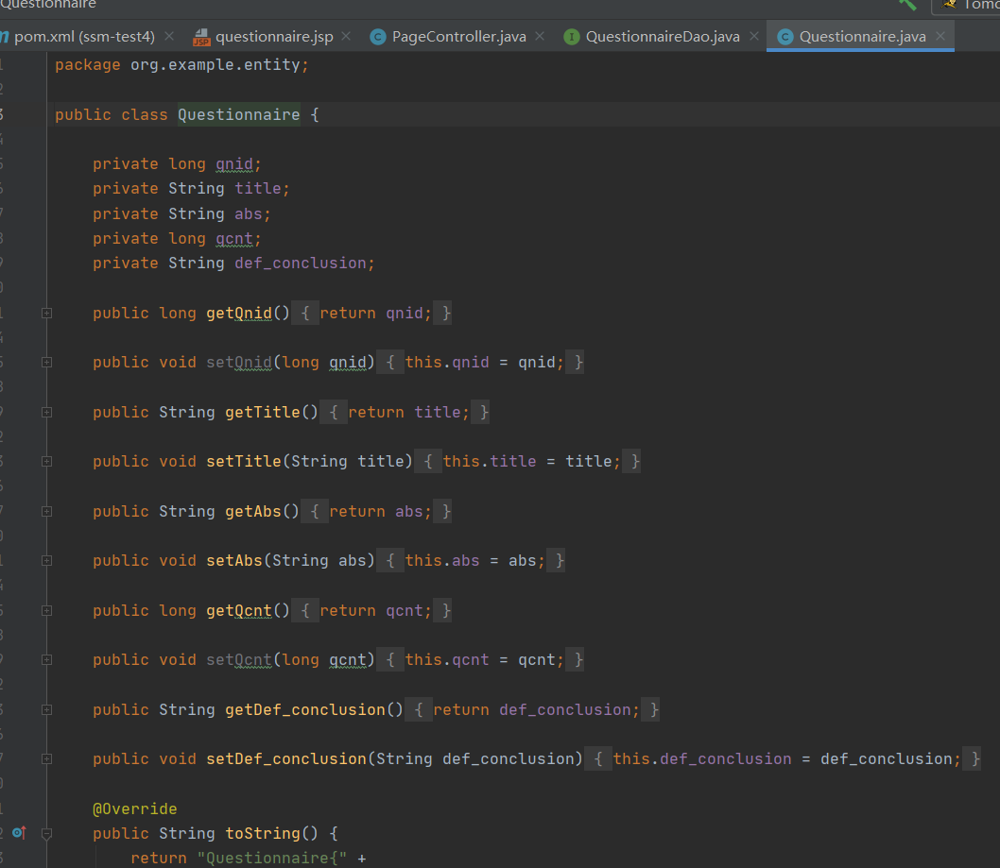

有了模型之后，我们需要一个**控制器**来控制数据的存取。

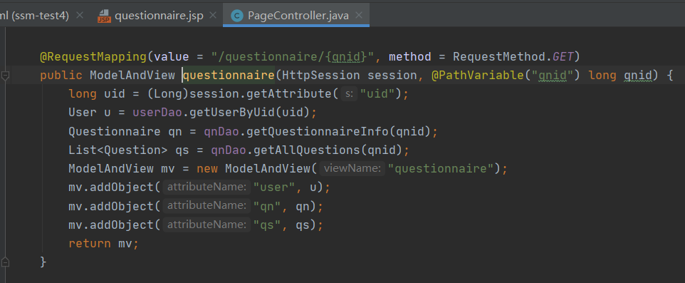

在获取到数据之后，相应的数据需要呈现给用户。由于用户在不同场景中需要的数据并不相同，故应根据场景构建不同的**视图**。如下则是填写问卷的视图设计。

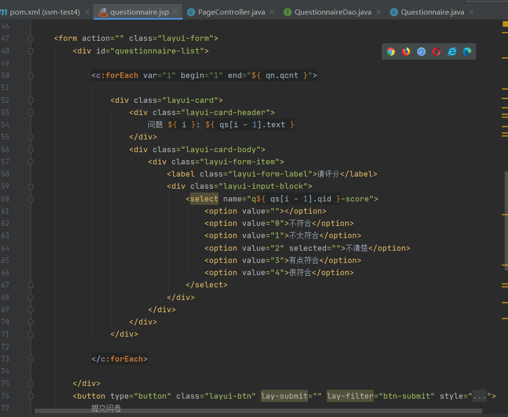

界面效果如下。

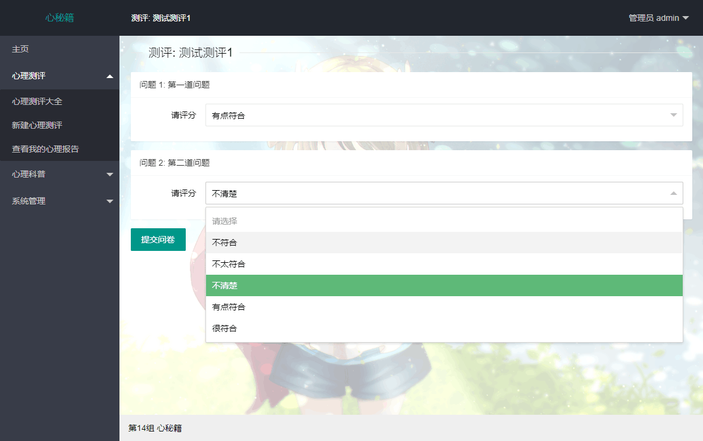

其余功能都是基于以上步骤进行迭代开发。

------

## 系统测试

### 注册模块

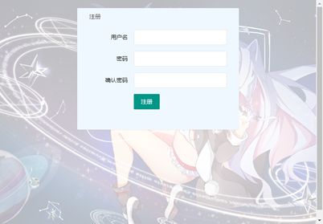

### 登录模块

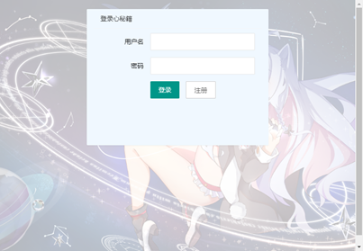

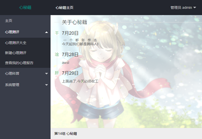

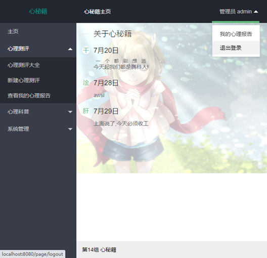

### 问卷模块

#### 新建测评(管理员)

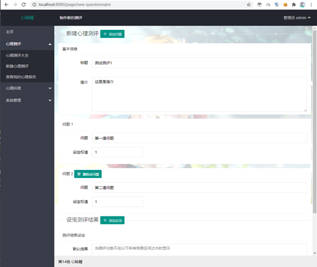

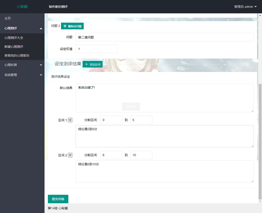

#### 查看测评

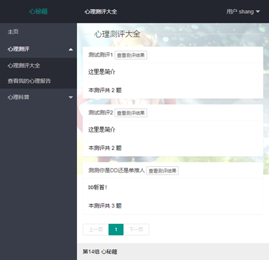

#### 删除测评(管理员)

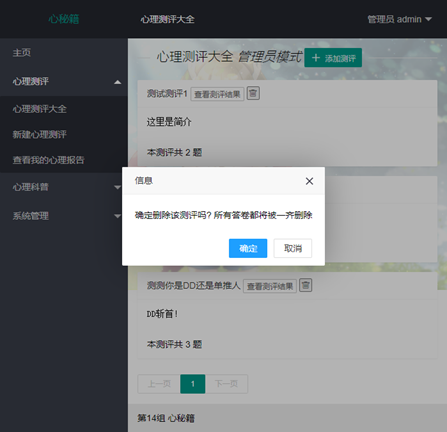

#### 填写测评

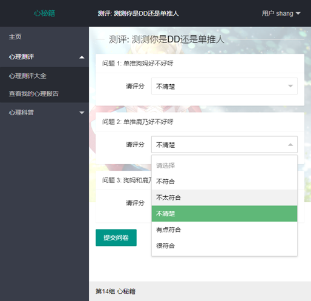

#### 查看测评结果

普通用户只需要关心测评结果即可，分数并不会直接提供给用户；若测评未完成则提供测评跳转链接；管理员可以看到问卷的真实分数。

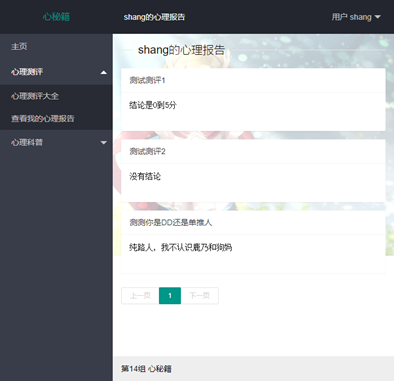

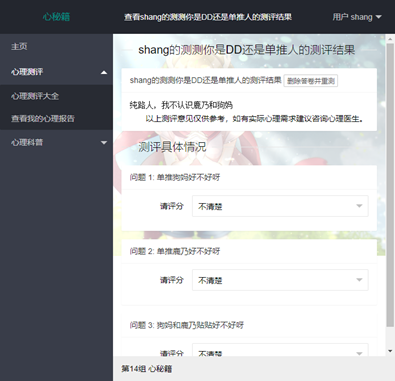

### 专栏模块

#### 发表专栏

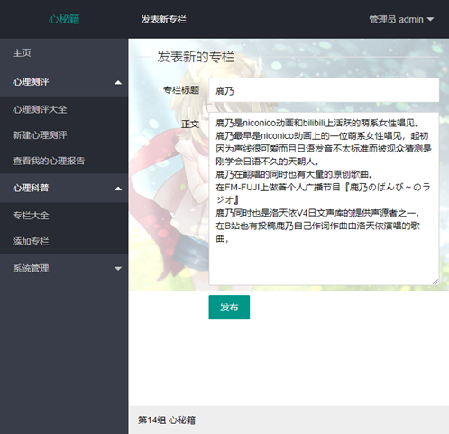

#### 查看专栏

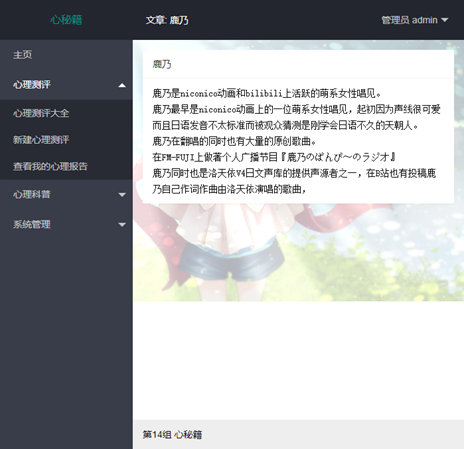

#### 删除专栏

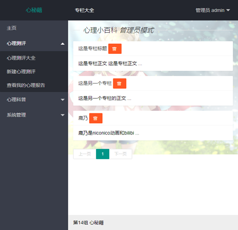

### 用户管理模块

管理员可以修改用户的权限，对应修改数据库管理员识别字段。(权限升级后原不可见的实际分数变得可见，说明升级成功。)

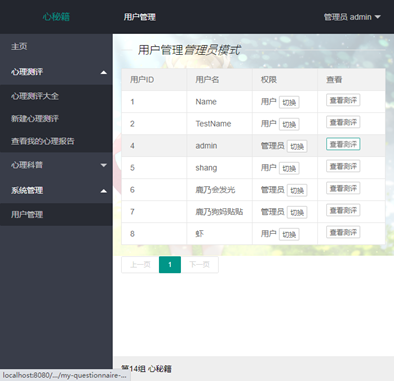

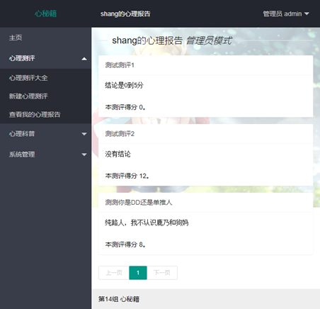

------

## 总结与展望

本次项目时间比较紧，总体进度可以说很赶。但最终还是圆满完成了开发任务，发现的bug也都修复了。通过5天的学习和接近一个星期的紧张开发，我们掌握了一套经典的Web应用开发流程，包括前端、后台、服务器部署、协作开发、数据库、MVC模式实践、项目打包；对SSM流程有了一个更为清晰的认识，也了解了一个Web应用是如何诞生的，收获很多。

在项目验收环节，老师也给出了几个中肯的建议，让我们对项目的后续完善和优化有了更明确的方向。在问卷选项设置上可以给用户提供更多元的选择，对应要修改后台数据库的架构，重新设计数据库表，并针对可能的大型应用场景做查询优化和并发考量。